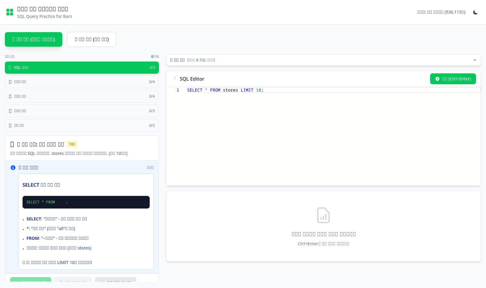
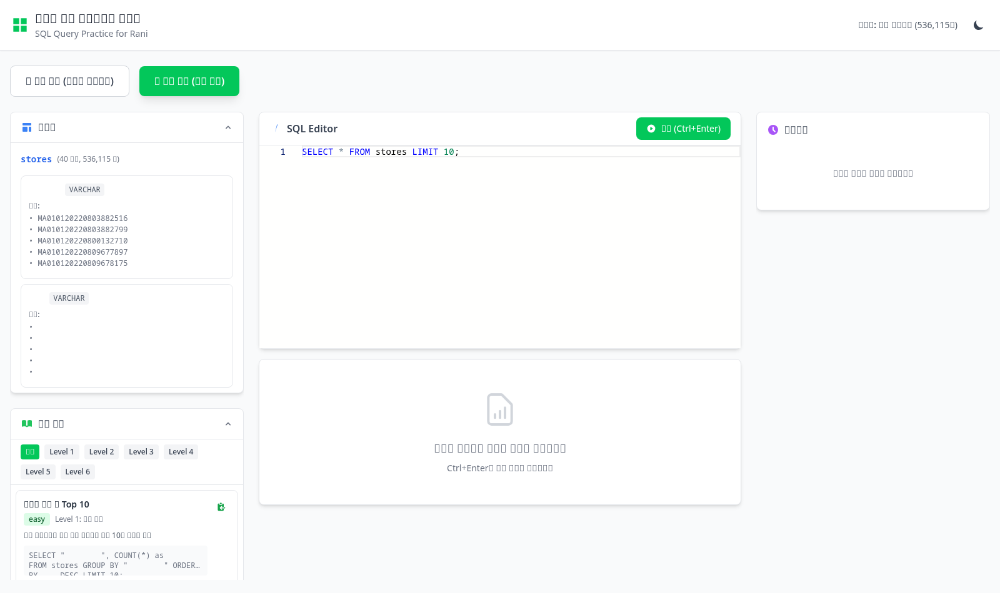

# 라니를 위한 SQL 쿼리테스트 플랫폼

<p align="center">
  
</p>

네이버파이낸셜 데이터 분석가 포지션의 쿼리 테스트를 준비하기 위한 **인터랙티브 SQL 학습 웹 애플리케이션**입니다.

53만 건 이상의 실제 상가(상권) 데이터를 활용하여 실무와 유사한 환경에서 SQL 쿼리 작성 능력을 향상시킬 수 있습니다.

---

## 주요 특징

| 특징 | 설명 |
|------|------|
| **완전한 브라우저 실행** | 서버 없이 브라우저에서 모든 SQL 쿼리 실행 (sql.js WebAssembly) |
| **실제 데이터** | 소상공인시장진흥공단 상가정보 536,115건 |
| **단계별 학습** | 16개의 실무 중심 문제를 6단계 난이도로 제공 |
| **즉각적인 피드백** | 쿼리 실행 결과와 정답 비교를 통한 학습 |
| **VS Code 에디터** | Monaco Editor 기반의 강력한 SQL 편집 환경 |

---

## 스크린샷

### 학습 모드 (단계별 문제풀이)

<p align="center">
  
</p>

- **왼쪽 패널**: 단계별 학습 진행률과 현재 문제
- **오른쪽 패널**: SQL Editor와 실행 결과
- **힌트 시스템**: 각 문제별 SQL 문법 힌트 제공
- **정답 확인**: 내 쿼리 결과와 정답 비교

### 연습 모드 (자유 쿼리)

<p align="center">
  
</p>

- **스키마 뷰어**: 테이블 구조와 샘플 데이터 확인
- **예제 쿼리**: 6단계 난이도별 예제 쿼리 라이브러리
- **쿼리 히스토리**: 실행한 쿼리 자동 저장 (LocalStorage)

---

## 학습 커리큘럼

### Level 1: SQL 기초 (3문제)
| 문제 | 학습 내용 |
|------|----------|
| 데이터 조회 | `SELECT`, `FROM`, `LIMIT` |
| 업종별 Top 10 | `GROUP BY`, `COUNT(*)`, `ORDER BY` |
| 특정 지역 필터링 | `WHERE`, 조건절 |

### Level 2: 집계 함수 (4문제)
| 문제 | 학습 내용 |
|------|----------|
| 구별 상가 수 | `GROUP BY`, `COUNT`, 지역 분석 |
| 업종 다양성 | `COUNT(DISTINCT)` |
| 다중 조건 필터링 | `AND`, `OR` 조건 조합 |
| 정렬 응용 | 다중 컬럼 정렬 |

### Level 3: 고급 필터링 (4문제)
| 문제 | 학습 내용 |
|------|----------|
| 패턴 검색 | `LIKE`, 와일드카드 (`%`, `_`) |
| 범위 필터링 | `BETWEEN`, `IN` |
| 집계 조건 | `HAVING` |
| NULL 처리 | `IS NULL`, `COALESCE` |

### Level 4: 분석 함수 (3문제)
| 문제 | 학습 내용 |
|------|----------|
| 순위 함수 | `ROW_NUMBER()`, `RANK()`, `DENSE_RANK()` |
| 파티션 분석 | `PARTITION BY` |
| 윈도우 집계 | `SUM() OVER()`, `AVG() OVER()` |

### Level 5: 서브쿼리 (2문제)
| 문제 | 학습 내용 |
|------|----------|
| 스칼라 서브쿼리 | `SELECT` 절 서브쿼리 |
| 인라인 뷰 | `FROM` 절 서브쿼리 |

### Level 6: CTE & 고급 (추가 예정)
| 문제 | 학습 내용 |
|------|----------|
| CTE 활용 | `WITH` 절, 재귀 CTE |
| 복합 분석 | 다중 CTE 조합 |

---

## 데이터 소개

### 출처
- **제공**: 소상공인시장진흥공단
- **데이터셋**: 상가(상권)정보
- **출처**: [공공데이터포털](https://www.data.go.kr/)

### 데이터 규모
| 항목 | 값 |
|------|-----|
| 총 레코드 수 | 536,115건 |
| 컬럼 수 | 40개 |
| 지역 | 서울특별시 전체 |
| 데이터 기준 | 2024년 |

### 주요 컬럼
```
상호명          - 상가 이름
상권업종대분류명  - 대분류 업종 (음식, 소매, 서비스 등)
상권업종중분류명  - 중분류 업종
상권업종소분류명  - 소분류 업종
시도명          - 시/도
시군구명        - 시/군/구
행정동명        - 행정동
법정동명        - 법정동
도로명주소      - 도로명 주소
경도           - GPS 경도 좌표
위도           - GPS 위도 좌표
```

---

## 기술 스택

### Frontend
| 기술 | 용도 |
|------|------|
| React 18 | UI 라이브러리 |
| Vite | 빌드 도구 |
| Tailwind CSS | 스타일링 |
| Monaco Editor | SQL 에디터 |

### Backend (API 모드)
| 기술 | 용도 |
|------|------|
| Express.js | API 서버 |
| PostgreSQL | 데이터베이스 |
| Google OAuth | 인증 |

### 브라우저 DB 모드
| 기술 | 용도 |
|------|------|
| sql.js | WebAssembly SQLite |
| PapaParse | CSV 파싱 |

---

## 설치 및 실행

### 빠른 시작 (브라우저 DB 모드)

```bash
# 1. 저장소 클론
git clone https://github.com/Cloud-Linuxer/sql-study.git
cd sql-study

# 2. 의존성 설치
npm install

# 3. 개발 서버 실행
npm run dev
```

브라우저에서 `http://localhost:5173` 접속

### API 모드 (PostgreSQL)

```bash
# 1. PostgreSQL 설정
cd server
cp .env.example .env
# .env 파일 편집하여 DB 연결 정보 입력

# 2. 서버 실행
npm install
npm start

# 3. 프론트엔드 실행
cd ..
npm run dev
```

### 프로덕션 빌드

```bash
npm run build
npm run preview
```

---

## 사용 방법

### 1. 학습 모드

1. **문제 선택**: 왼쪽 패널에서 레벨과 문제 선택
2. **힌트 확인**: "SQL 문법 힌트" 섹션 참고
3. **쿼리 작성**: SQL Editor에서 쿼리 작성
4. **실행**: `Ctrl+Enter` 또는 "실행" 버튼 클릭
5. **정답 확인**: "정답 확인하기" 버튼으로 결과 비교

### 2. 연습 모드

1. **스키마 확인**: 왼쪽 상단의 스키마 뷰어에서 테이블 구조 확인
2. **예제 선택**: 레벨별 예제 쿼리 클릭하여 에디터에 로드
3. **자유 쿼리**: 원하는 SQL 쿼리 작성 및 실행
4. **히스토리 활용**: 오른쪽 패널에서 이전 쿼리 재실행

### 단축키

| 단축키 | 기능 |
|--------|------|
| `Ctrl + Enter` | 쿼리 실행 |
| `Ctrl + /` | 주석 토글 |
| `Ctrl + Space` | 자동완성 |

---

## 예제 쿼리

### 기본 집계
```sql
-- 업종별 상가 수 Top 10
SELECT
  "상권업종대분류명",
  COUNT(*) as 상가수
FROM stores
GROUP BY "상권업종대분류명"
ORDER BY 상가수 DESC
LIMIT 10;
```

### 지역 분석
```sql
-- 강남구 음식점 현황
SELECT
  "상권업종중분류명",
  COUNT(*) as 상가수
FROM stores
WHERE "시군구명" = '강남구'
  AND "상권업종대분류명" = '음식'
GROUP BY "상권업종중분류명"
ORDER BY 상가수 DESC;
```

### 윈도우 함수
```sql
-- 구별 업종 순위
WITH RankedIndustries AS (
  SELECT
    "시군구명",
    "상권업종대분류명",
    COUNT(*) as 상가수,
    ROW_NUMBER() OVER (
      PARTITION BY "시군구명"
      ORDER BY COUNT(*) DESC
    ) as 순위
  FROM stores
  GROUP BY "시군구명", "상권업종대분류명"
)
SELECT * FROM RankedIndustries
WHERE 순위 <= 3
ORDER BY "시군구명", 순위;
```

### CTE 활용
```sql
-- 평균 이상 상가 보유 구
WITH district_stats AS (
  SELECT
    "시군구명",
    COUNT(*) as 상가수
  FROM stores
  GROUP BY "시군구명"
),
avg_stats AS (
  SELECT AVG(상가수) as 평균
  FROM district_stats
)
SELECT
  d."시군구명",
  d.상가수,
  ROUND(d.상가수 - a.평균, 0) as 평균대비
FROM district_stats d, avg_stats a
WHERE d.상가수 > a.평균
ORDER BY d.상가수 DESC;
```

---

## 면접 대비 전략

### 네이버파이낸셜 맥락

1. **사업자 리포트 기획**
   - 업종별/지역별 집계 분석
   - 시계열 트렌드 파악
   - 세그먼트 특성 분석

2. **고객 타겟 마케팅**
   - 특정 조건 사업자 추출
   - 상권 기반 타겟팅
   - 프랜차이즈 vs 개인 사업자

3. **데이터 기반 의사결정**
   - 시장 기회 분석
   - 경쟁 밀집도 파악
   - 진입 가능 상권 탐색

### SQL 역량 체크리스트

- [ ] `SELECT`, `WHERE`, `GROUP BY`, `ORDER BY` 기본 문법
- [ ] `COUNT`, `SUM`, `AVG`, `MIN`, `MAX` 집계 함수
- [ ] `JOIN` (INNER, LEFT, RIGHT)
- [ ] `ROW_NUMBER`, `RANK`, `DENSE_RANK` 윈도우 함수
- [ ] `PARTITION BY` 파티션 분석
- [ ] `WITH` CTE 활용
- [ ] 서브쿼리 (스칼라, 인라인 뷰, 상관)

---

## 프로젝트 구조

```
sql-study/
├── docs/                          # 문서 및 스크린샷
│   ├── screenshot-learning.png    # 학습 모드 스크린샷
│   └── screenshot-practice.png    # 연습 모드 스크린샷
├── public/
│   └── data/
│       └── store_data.zip         # 상가정보 CSV (압축)
├── server/                        # API 서버 (PostgreSQL 모드)
│   ├── server.js
│   ├── package.json
│   └── .env.example
├── src/
│   ├── components/
│   │   ├── Header.jsx             # 앱 헤더
│   │   ├── SQLEditor.jsx          # Monaco 에디터
│   │   ├── ResultTable.jsx        # 결과 테이블
│   │   ├── SchemaViewer.jsx       # 스키마 뷰어 (브라우저 DB)
│   │   ├── SchemaViewerAPI.jsx    # 스키마 뷰어 (API)
│   │   ├── ExampleQueries.jsx     # 예제 쿼리 목록
│   │   ├── QueryHistory.jsx       # 쿼리 히스토리
│   │   ├── QuizMode.jsx           # 학습 모드 컴포넌트
│   │   ├── QuickReference.jsx     # SQL 빠른 참조
│   │   └── TutorialContent.jsx    # 튜토리얼 컨텐츠
│   ├── hooks/
│   │   ├── useDatabase.js         # 브라우저 DB 훅
│   │   ├── useDatabaseAPI.js      # API DB 훅
│   │   └── useQueryHistory.js     # 히스토리 관리
│   ├── data/
│   │   ├── exampleQueries.js      # 예제 쿼리 데이터
│   │   └── quizProblems.js        # 학습 문제 데이터
│   ├── utils/
│   │   ├── csvLoader.js           # CSV 로딩
│   │   ├── sqlHelpers.js          # SQL 유틸리티
│   │   └── quizValidator.js       # 정답 검증
│   ├── App.jsx                    # 메인 앱
│   ├── main.jsx                   # 엔트리 포인트
│   └── index.css                  # 글로벌 스타일
├── backup/                        # DB 백업 스크립트
├── package.json
├── vite.config.js
├── tailwind.config.js
├── CLAUDE.md                      # 프로젝트 설계 문서
└── README.md
```

---

## 개발 로드맵

- [x] 기본 SQL 에디터 및 실행 환경
- [x] 브라우저 기반 SQLite (sql.js)
- [x] 학습 모드 (단계별 문제풀이)
- [x] 연습 모드 (자유 쿼리)
- [x] 예제 쿼리 라이브러리
- [x] 쿼리 히스토리
- [x] 다크 모드
- [x] PostgreSQL API 모드
- [ ] 추가 학습 문제 (Level 6)
- [ ] 쿼리 결과 시각화 (차트)
- [ ] 쿼리 공유 기능
- [ ] 모바일 반응형 개선

---

## 라이선스

MIT License

---

## 기여

버그 리포트, 기능 제안, PR 모두 환영합니다!

1. Fork the repository
2. Create your feature branch (`git checkout -b feature/amazing-feature`)
3. Commit your changes (`git commit -m 'Add amazing feature'`)
4. Push to the branch (`git push origin feature/amazing-feature`)
5. Open a Pull Request

---

## 문의

프로젝트 관련 문의사항은 [GitHub Issues](https://github.com/Cloud-Linuxer/sql-study/issues)를 활용해주세요.
